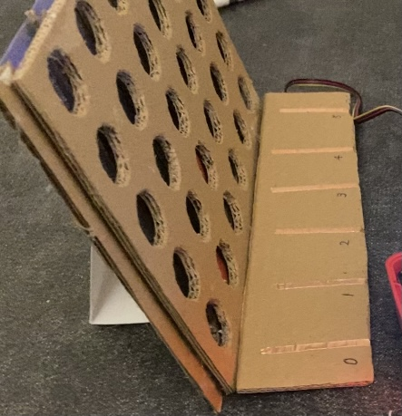

# Final Project - Connect Four

Using the tools and techniques you learned in this class, design, prototype and test an interactive device.

Project Github page set up - May 3

Functional check-off - May 10
 
Final Project Presentations (video watch party) - May 12

Final Project Documentation due - May 19

## Description
In our final project, we used our Raspeberry Pi to simulate the Connect Four game. 

The game features two players - each has their own set of boards and discs - playing the game remotely. The players would take turns to drop discs into a six-column, five-row cardboard grid. A player gets to win the game if four of his/her discs form a horizontal. vertical, or diagonal line. 

## Deliverables

1. Documentation of design process
2. Archive of all code, design patterns, etc. used in the final design. (As with labs, the standard should be that the documentation would allow you to recreate your project if you woke up with amnesia.)
3. Video of someone using your project (or as safe a version of that as can be managed given social distancing)
4. Reflections on process (What have you learned or wish you knew at the start?)

## Documentation of Design Process

### System design

The system consists of two Rasperry Pis, each one is connected to its screen and capacitive touch sensor. The screen is used to display messages and update the system status. The touch sensor are connected to a board that has six vertical lines, each corresponds to one column on the chessboard. 

Once the game starts, we also establish a communication channel using the MQTT explorer. A message containing the move and the player's name is sent through the channel after a player touches a sensor. After receiving the message from the other player, the player has to update the board on his/her side following the screen instruction before he/she could make a move. 

The game continues until a player wins or the board is filled with discs (Theoratically the first player could always win by playing the right move).  The screen displays 'you won' message immediately follows the player's move. The other player sees the result on the screen after he/she updates the other player' s move. 

An illustration of the flow design can be found below. 

### Chessboard design

Our Connect four game uses a 6 * 5 grid chessboard. We made the board by sticking three cardboards together like a sandwich. The front layer crops 5 holes of each column. The holes are a little smaller than the discs. 

The cardboard in the middle are seven thin lines to hold and separate each column of discs. 

An additional piece of rectangular cardboard is sticked on at the back so that the discs stays in between the boards and won't fall from behind. 

### Functional design

We separated the code into two separate files for each player (`connect-4-O.py` and `connect-4-X.py`). The one playing the chess X will be the one that makes the first move. 

Each side of the player has a virtual board, that records the current state of the actual board of that player. 

**Making your move**

To make a move, the player needs to place the disc at the column he wants to place it, and press on the corresponding column on the touch pad to update Pi about the move made. Our program keeps a record of which row the player could place the disc at. After reading the touch signal, the program updates the virtual board using ``get_next_open_row`` function. 

**Communication**

The `on_connect` and `on_message` functions are used for communicating what move they are making. Each side acts as both the sender and the receiver: they send a message right after a valid move is made (i.e. a touch sensor representing a column that is not full is triggered), and they keep monitoring the messages and get informed when their opponent has made a move. 

**Update opponent's move**

Once the opponent has made a move, the player needs to update their board accordingly. This is accomplished by displaying what the other player placed their move on the screen. The player need to drop the disc at the corresponding column and press the corresponding touch sensor. The screen displays 'Done' once the player finishes updating. The player can then decide on his/her own move.  

**Winning/Losing the game**

After each move, the program runs ``winning_move`` function to check whether . This checks on each column, row, positively sloped and negatively sloped diagonols to see if there are four discs connecting with each other. If this function returns True, then the game is ended and the screen will display a winning message. 

### Video

The demo video could be found here: https://youtu.be/OCgLxLWi-co

## Reflection

On the hardware side. We spent quite some time figuring out how to make the board and the cutting of the board took an unexpected amount of time because we needed to make two sets of boards, and we have to carve the holes out for each board. 

On the coding side, we were stucked on how to listen to the channel and update the board in real-time, and ended up using global variable to synchronize the two ends of the system. 

The debugging also took us a while. Two players have different logic behind their starting conditions, and each requires listening to the channel and updating their boards. We had to test the two sets of code individually, which includes testing the functionality of the physical touch pads, the MQTT sender and receiver module, the update of the board, as well as the winning and losing conditions. 

## Our Team

- Yanjun Zhou

- Yimeng Sun

- Renzhi Hu

