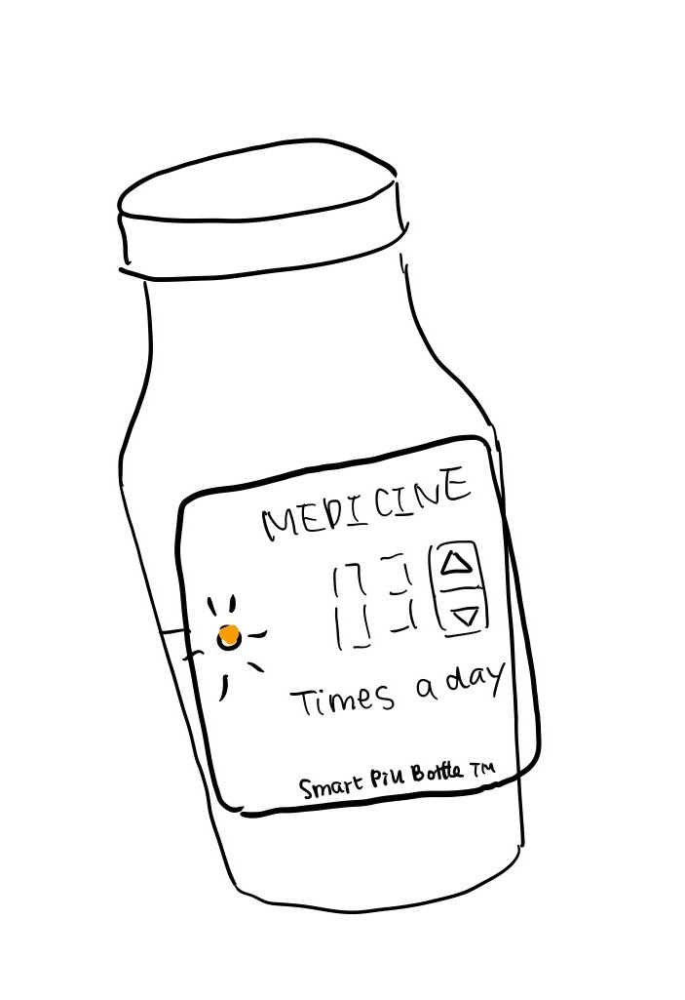
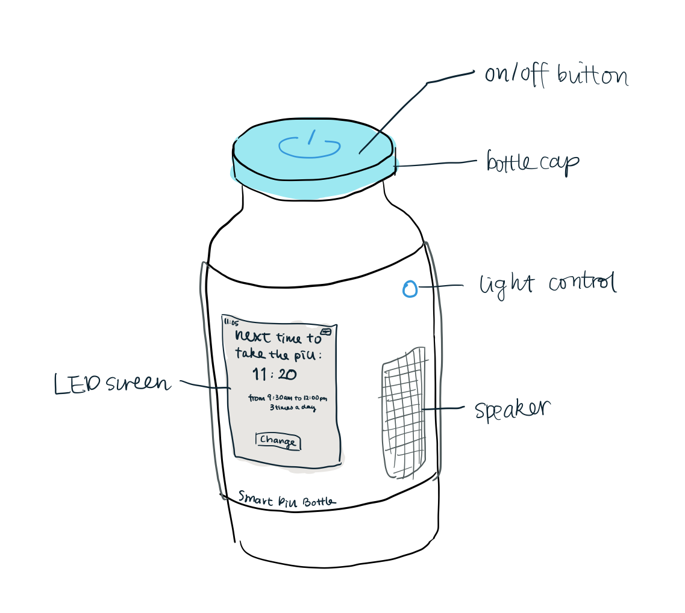
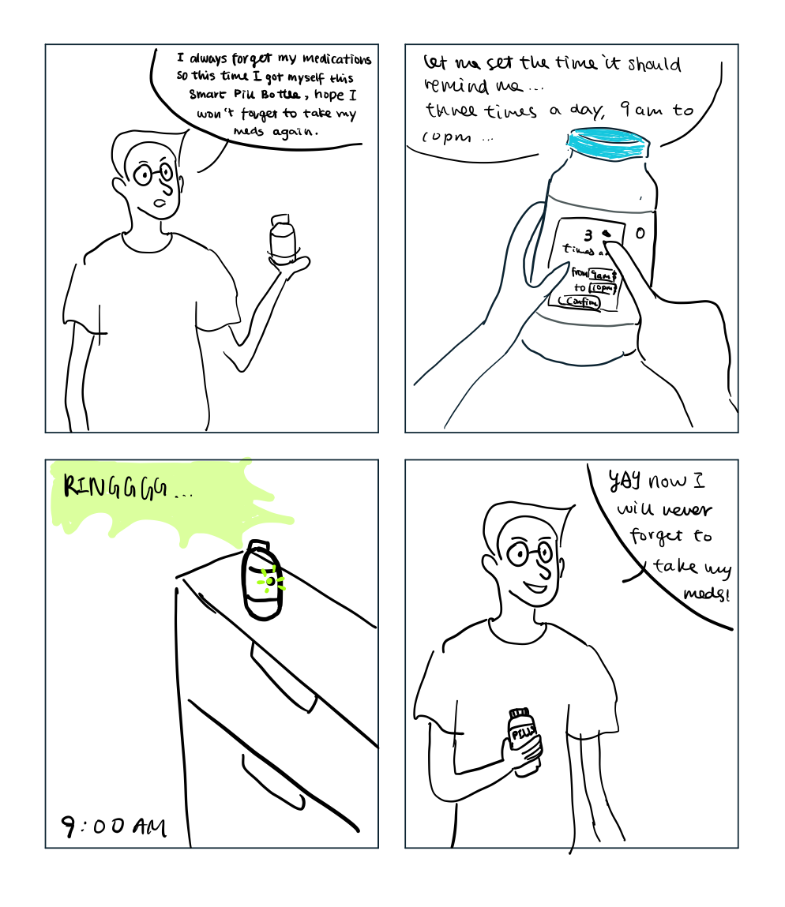

### Deliverables for this lab are: 
1. Storyboard
1. Sketches/photos of costumed device
1. Any reflections you have on the process.
1. Video sketch of the prototyped interaction.
1. Submit these in the lab1 folder of your class [Github page], either as links or uploaded files. Each group member should post their own copy of the work to their own Lab Hub, even if some of the work is the same for each person in the group.

## Overview
For this assignment, you are going to 

A) [Plan](#part-a-plan) 

B) [Act out the interaction](#part-b-act-out-the-interaction) 

C) [Prototype the device](#part-c-prototype-the-device)

D) [Wizard the device](#part-d-wizard-the-device) 

E) [Costume the device](#part-e-costume-the-device)

F) [Record the interaction](#part-f-record)

## Report
## Part A. Plan 

**Describe your setting, players, activity and goals here.**
I plan to design a smart medicine bottle that can gives sound and light effects to remind the person to take the medicine when it is time.  
Settings: This interaction will take place in someone's home, usually at his own bedroom/study room where he puts his medicines. The interaction happens when the user needs to take his medicine on a regular basis, it could be at a certain time of a day or happens several times a day. 
Player: There is only one player in this interaction - the user of the device. 
Activity: The player need to interact with the device. When it reaches the time set before, the device would send sound and light signal; the player will get notified and then take the medicine. 
Goal: The player's goal is to be reminded to keep healthy and take his medications on time. 

**Include a picture of your storyboard here**

**Summarize feedback you got here.**
1. I could make use of the color of the light to indicate what kind of pill I should take.
2. I should also take into consideration of other people that might be living with this person. 

## Part B. Act out the Interaction

**Are there things that seemed better on paper than acted out?**
The interaction was natural and seems better than paper. 
**Are there new ideas that occur to you or your collaborators that come up from the acting?**

## Part C. Prototype the device

<<<<<<< HEAD
=======
You will be using your smartphone as a stand-in for the device you are prototyping. You will use the browser of your smart phone to act as a “light” and use a remote control interface to remotely change the light on that device. 

Code for the "Tinkerbelle" tool, and instructions for setting up the server and your phone are [here](https://github.com/FAR-Lab/tinkerbelle).

We invented this tool for this lab! 

If you run into technical issues with this tool, you can also use a light switch, dimmer, etc. that you can can manually or remotely control.

>>>>>>> 02f063eaf98c393c66476b33b6da4e1391f14301
**Give us feedback on Tinkerbelle.**
Overall I think Tinkerbelle is very very simple and easy to use as an app prototype, with customizable fields suitable to my own needs. There could also be a lot of potential add-ons to it, such as displaying texts, pictures, etc. 
## Part D. Wizard the device
Take a little time to set up the wizarding set-up that allows for someone to remotely control the device while someone acts with it. Hint: You can use Zoom to record videos, and you can pin someone’s video feed if that is the scene which you want to record. 

**Include your first attempts at recording the set-up video here.**

**Show the follow-up work here.**

## Part E. Costume the device

Only now should you start worrying about what the device should look like. Develop a costume so that you can use your phone as this device.

Think about the setting of the device: is the environment a place where the device could overheat? Is water a danger? Does it need to have bright colors in an emergency setting?

**Include sketches of what your device might look like here.**

**What concerns or opportunitities are influencing the way you've designed the device to look?**
I want the device to have a input field where the user could set up how many times a day he needs to take the medicine.  

## Part F. Record

**Take a video of your prototyped interaction.**

**Please indicate anyone you collaborated with on this Lab.**
I collaborated with Charles Chen from Columbia University. He took the videos for me. 
Renzhi, Panda, Songyu and Wenqing offered great advice on my idea. 

# Staging Interaction, Part 2 

This describes the second week's work for this lab activity.

## Prep (to be done before Lab on Wednesday)

You will be assigned three partners from another group. Go to their github pages, view their videos, and provide them with reactions, suggestions & feedback: explain to them what you saw happening in their video. Guess the scene and the goals of the character. Ask them about anything that wasn’t clear. 

**Summarize feedback from your partners here.**

**Renzhi Hu**
What’s happening:
The light device functions as a reminder to remind the user to take medications daily.
The scene and the goals of the character:
Scene: the user is working and possibly forgets to take daily medicines
Goal: to be reminded when it’s time to take medication/supplements
Anything that wasn’t clear:
The prototype is shown in gifs instead of videos so the interactions are limited. I’d like to see more about what happens to the device in different circumstances. For instance, how the alarm is set, and how the light would be turned off when the user takes its medication.

**Wenqing Tang**
How will the light be turned off after the user took the pill? Maybe there will be a sensor inside?
For 3 times a day, there could be many time settings, e.g. 3 AM, 11 AM and 7 PM - which no one will probably want to get up at 3 AM to take a pill. So I suggest you may add an input for the start time on the device.

**Songyu Du**
I saw a device remind the user to take medicine at a certain time by glowing green light and ringing.
Scene: At anywhere near the user.
Goal: to remind users to take medicine at their designated time.
Not clear: When does the light go off? Seemed like the light was still green after the user took her medicine. Also, how to set up the time of the reminder? Not sure just from the video. Maybe could incorporate voice control.

**Panda Xu** 
I really like the idea of using light to remind people to take their pills. It's extremely useful because we tend to forget to take our medicine when we are busy, which is not good for our health. In the video, I saw that the user was working on her laptop and her pill bottle was dark initially. After a while, the pill bottle ringed up and the light indicator turned green to remind the user to take pills. The goal of the character is to take pills on time and the device does a good job on that. One thing I might suggest is to build the light indicator on the cap of the bottle so users can see it from any angle.

## Make it your own

Do last week’s assignment again, but this time: 
1) It doesn’t have to (just) use light, 
2) You can use any modality (e.g., vibration, sound) to prototype the behaviors, 
3) We will be grading with an emphasis on creativity. 

<<<<<<< HEAD
**Document everything here.**

Refined Prototype

Refined storyboard

Refined Video
https://youtu.be/MVZs3iS3LeY
=======
**Document everything here. (Particularly we'd like to see the storyboard and video, although photos of the prototype are also great.)**
>>>>>>> 02f063eaf98c393c66476b33b6da4e1391f14301
