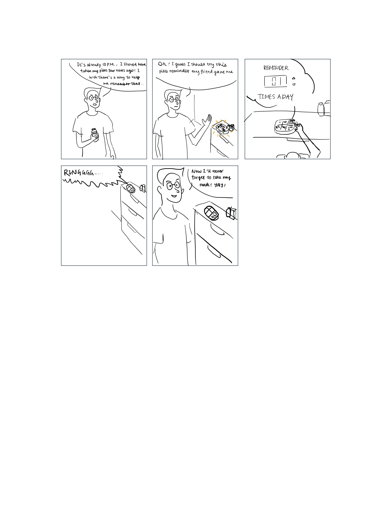

# Staging Interaction

In the original stage production of Peter Pan, Tinker Bell was represented by a darting light created by a small handheld mirror off-stage, reflecting a little circle of light from a powerful lamp. Tinkerbell communicates her presence through this light to the other characters. See more info [here](https://en.wikipedia.org/wiki/Tinker_Bell). 

There is no actor that plays Tinkerbell--her existence in the play comes from the interactions that the other characters have with her.

For lab this week, we draw on this and other inspirations from theatre to stage interactions with a device where the main mode of display/output for the interactive device you are designing is lighting. You will plot the interaction with a storyboard, and use your computer and a smartphone to experiment with what the interactions will look and feel like. _Make sure you read all the instructions and understand the whole of the laboratory activity before starting!_

## Prep

1. Set up [your Github "Lab Hub" repository](../../../) by [following these instructions](https://github.com/FAR-Lab/Developing-and-Designing-Interactive-Devices/blob/2021Spring/readings/Submitting%20Labs.md).
2. Set up the README.md for your Hub repository (for instance, so that it has your name and points to your own Lab 1) and [learn how](https://guides.github.com/features/mastering-markdown/) to post links to your submissions on your readme.md so we can find them easily.

### For lab, you will need:

1. Paper
1. Markers/ Pen
1. Smart Phone--Main required feature is that the phone needs to have a browser and display a webpage.
1. Computer--we will use your computer to host a webpage which also features controls
1. Found objects and materials--you’ll have to costume your phone so that it looks like some other device. These materials can include doll clothes, a paper lantern, a bottle, human clothes, a pillow case. Be creative!
1. Scissors

### Deliverables for this lab are: 
1. Storyboard
1. Sketches/photos of costumed device
1. Any reflections you have on the process.
1. Video sketch of the prototyped interaction.
1. Submit these in the lab1 folder of your class [Github page], either as links or uploaded files. Each group member should post their own copy of the work to their own Lab Hub, even if some of the work is the same for each person in the group.

## Overview
For this assignment, you are going to 

A) [Plan](#part-a-plan) 

B) [Act out the interaction](#part-b-act-out-the-interaction) 

C) [Prototype the device](#part-c-prototype-the-device)

D) [Wizard the device](#part-d-wizard-the-device) 

E) [Costume the device](#part-e-costume-the-device)

F) [Record the interaction](#part-f-record)

## Report
## Part A. Plan 

**Describe your setting, players, activity and goals here.**
I am planning to design a smart medicine bottle that can gives sound and light effects to remind the person to take the medicine when it is time.  
Settings: This interaction will take place in someone's home, usually at his own bedroom/study room where he puts his medicines. The interaction happens when the user needs to take his medicine on a regular basis, it could be at a certain time of a day or happens several times a day. 
Player: There is only one player in this interaction - the user of the device. 
Activity: The player need to interact with the device. When it reaches the time set before, the device would send sound and light signal; the player will get notified and then take the medicine. 
Goal: The player's goal is to be reminded to keep healthy and take his medications on time. 

**Include a picture of your storyboard here**

**Summarize feedback you got here.**
1. I could make use of the color of the light to indicate what kind of pill I should take.
2. I should also take into consideration of other people that might be living with this person. 

## Part B. Act out the Interaction

Try physically acting out the interaction you planned. For now, you can just pretend the device is doing the things you’ve scripted for it. 

**Are there things that seemed better on paper than acted out?**

**Are there new ideas that occur to you or your collaborators that come up from the acting?**

## Part C. Prototype the device

**Give us feedback on Tinkerbelle.**
Overall I think Tinkerbelle is very very simple and easy to use as an app prototype, with customizable fields suitable to my own needs. There could also be a lot of potential add-ons to it, such as displaying texts, pictures, etc. 
## Part D. Wizard the device
Take a little time to set up the wizarding set-up that allows for someone to remotely control the device while someone acts with it. Hint: You can use Zoom to record videos, and you can pin someone’s video feed if that is the scene which you want to record. 

**Include your first attempts at recording the set-up video here.**

**Show the follow-up work here.**

## Part E. Costume the device

Only now should you start worrying about what the device should look like. Develop a costume so that you can use your phone as this device.

Think about the setting of the device: is the environment a place where the device could overheat? Is water a danger? Does it need to have bright colors in an emergency setting?

**Include sketches of what your device might look like here.**

**What concerns or opportunitities are influencing the way you've designed the device to look?**The user 

## Part F. Record

**Take a video of your prototyped interaction.**

**Please indicate anyone you collaborated with on this Lab.**
I collaborated with Charles Chen from Columbia University. He took the videos for me. 
Renzhi, Panda and Wenqing offered great advice on my idea. 

# Staging Interaction, Part 2 

This describes the second week's work for this lab activity.

## Prep (to be done before Lab on Wednesday)

You will be assigned three partners from another group. Go to their github pages, view their videos, and provide them with reactions, suggestions & feedback: explain to them what you saw happening in their video. Guess the scene and the goals of the character. Ask them about anything that wasn’t clear. 

**Summarize feedback from your partners here.**

## Make it your own

Do last week’s assignment again, but this time: 
1) It doesn’t have to (just) use light, 
2) You can use any modality (e.g., vibration, sound) to prototype the behaviors, 
3) We will be grading with an emphasis on creativity. 

**Document everything here.**
