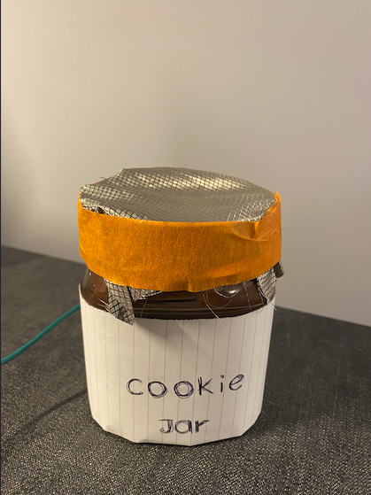

# Ph-UI!!!

For lab this week, we focus on the prototyping the physical look and feel of the device. _Make sure you read all the instructions and understand the whole of the laboratory activity before starting!_

## Prep

1. Pull the new Github Repo.
2. Readings:

* [What do prototypes prototype?](https://www.semanticscholar.org/paper/What-do-Prototypes-Prototype-Houde-Hill/30bc6125fab9d9b2d5854223aeea7900a218f149)

* [Paper prototyping](https://www.uxpin.com/studio/blog/paper-prototyping-the-practical-beginners-guide/) is used by UX designers to quickly develop interface ideas and run them by people before any programming occurs.

* [Cardboard prototypes](https://www.youtube.com/watch?v=k_9Q-KDSb9o) help interactive product designers to work through additional issues, like how big something should be, how it could be carried, where it would sit.

* [Tips to Cut, Fold, Mold and Papier-Mache Cardboard](https://makezine.com/2016/04/21/working-with-cardboard-tips-cut-fold-mold-papier-mache/) from Make Magazine.

* [Surprisingly complicated forms](https://www.pinterest.com/pin/50032245843343100/) can be built with paper, cardstock or cardboard.  The most advanced and challenging prototypes to prototype with paper are [cardboard mechanisms](https://www.pinterest.com/helgangchin/paper-mechanisms/) which move and change.

 Dyson Vacuum cardboard prototypes

## Overview
Here are the parts of the assignment

A) [Capacitive Sensing](#part-a)

B) [OLED screen](#part-b)

C) [Paper Display](#part-c)

D) [Wizard the device](#part-d-wizard-the-device)

E) [Costume the device](#part-e-costume-the-device)

F) [Record the interaction](#part-f-record)

### Part A
### Capacitive Sensing, a.k.a. Human Banana Interaction

### Part B
### OLED screen

### Part C
### Paper Display

**a. Document the design for your paper display.**

**b. Make a video of your paper display in action.**
https://youtu.be/MlD30gqDNzw
(the first section of the video is my paper display in action)
**c. Explain the rationale for the design.**
My design is a intelligent cookie jar that notifies the owner if others steal things from it. The screen gives message once someone touches it. The camera is included to record the person who stole it. 

### Part D
### Materiality

**a. document the material prototype.**
Candidates that were considered: paper, box, glass.

**b. explain the selection.**
Since my design is a intelligent, anti-stolen cookie jar, I looked for jars or any materials that look more like a jar.
I thought about using a box or use paper for the cookie jar, but in the end I used an unfinished Nutella jar, and taped the raspberry pi to the wall.

### Part 2.

Following exploration and reflection from Part 1, complete the "looks like," "works like" and "acts like" prototypes for your design.

### Deliverables for this lab are:
1. Sketches/photos of device designs

2. "Looks like" prototypes: show us what how the device should look, feel, sit, weigh, etc.

3. "Works like" prototypes: show us what the device can do
https://youtu.be/MlD30gqDNzw
4. "Acts like" prototypes: videos/storyboards/other means of showing how a person would interact with the device

5. Submit these in the lab 4 folder of your class [Github page], either as links or uploaded files. Each group member should post their own copy of the work to their own Lab Hub, even if some of the work is the same for each person in the group.
